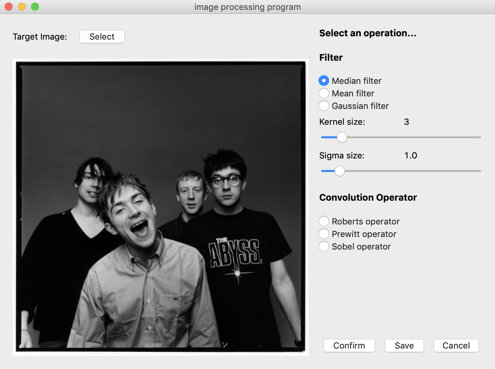
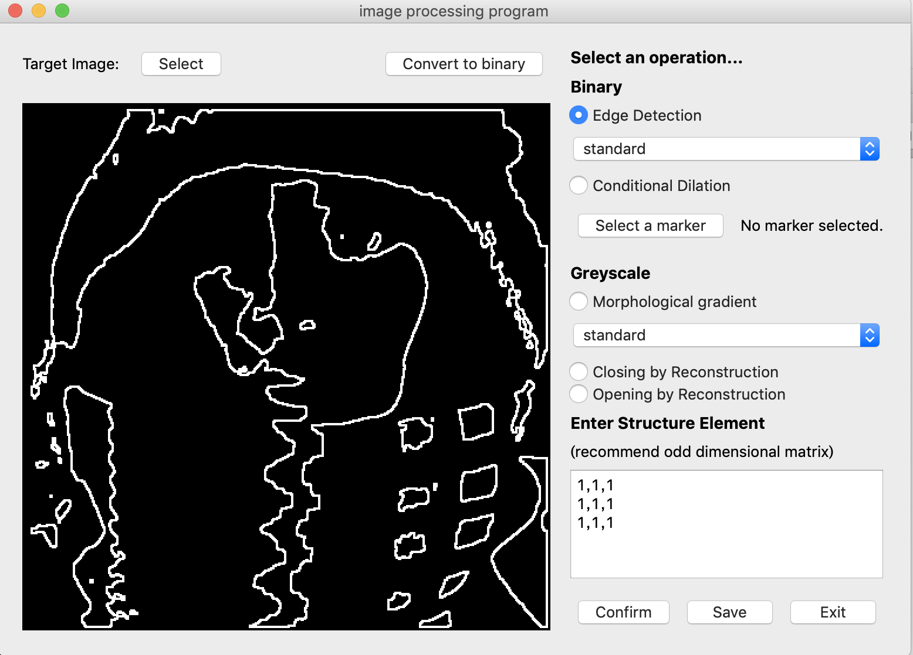

# Computer-Vision
Projects for 19fall Computer Vision course

## Project 1
Convolution and Image Filters

Requirement：
1. Program to realize the convolution operation and the next filters
	- Roberts operator; Prewitt operator; Sobel operator;
	- Gaussian filter, mean filter and Median filter
	- Kernal size and sigma adjustable
2. Design proper UI and display I/O images

## Project 2
Morphological operations

1. Morphological edge detection 
2. Morphological Reconstruction
	- Conditional dilation in binary image
	- Grey scale Reconstruction
	- Morphological gradient
3. Design proper UI and display I/O images

